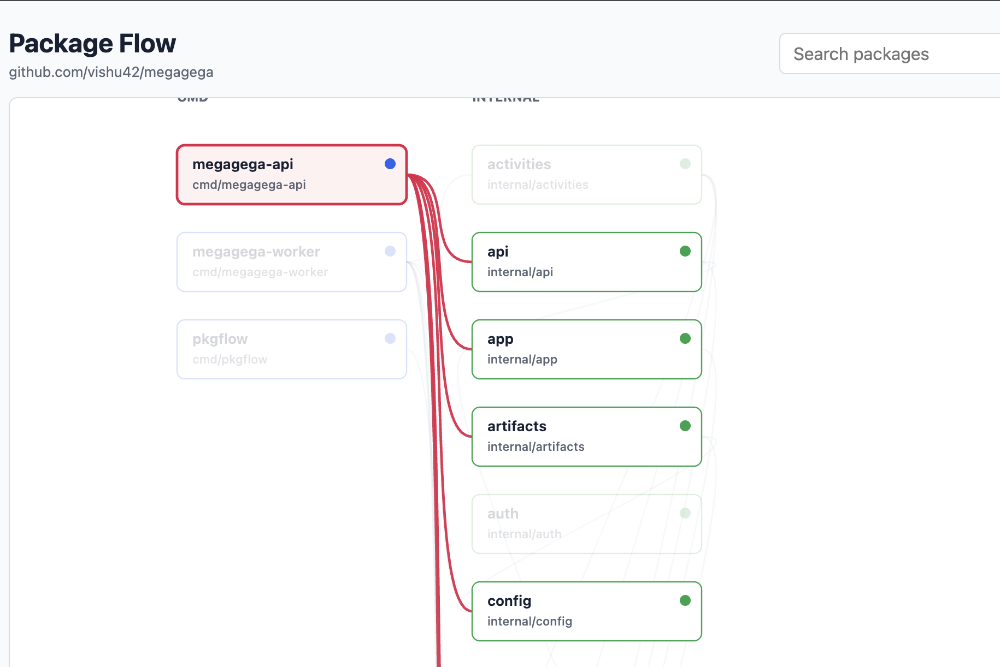

# go-pkg-flow

## install
```bash
go install github.com/vishu42/go-pkg-flow@latest
```

```bash
# run commands from root of the repo
go-pkg-flow -out pkgflow.html
go-pkg-flow -format dot -out pkgflow.dot
go-pkg-flow -include-external -out pkgflow.html
```


